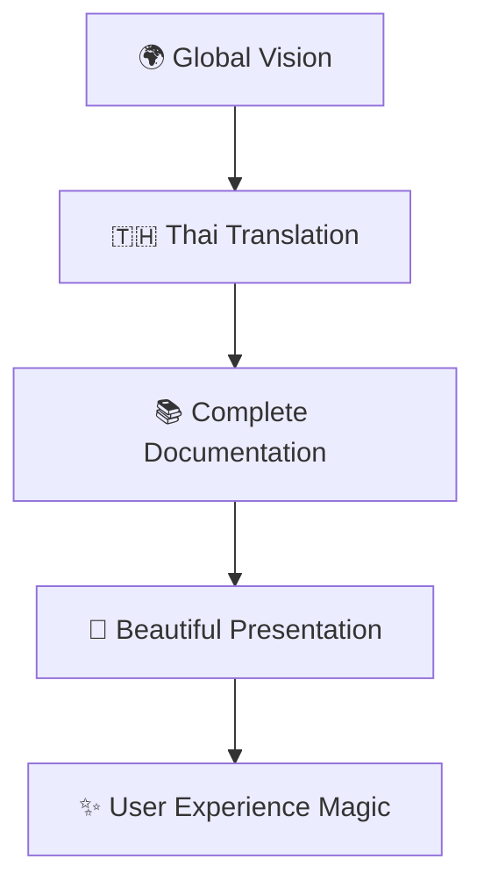

# 🌈 วันแห่งการเปลี่ยนแปลงครั้งยิ่งใหญ่!

:::danger เตือน: เนื้อหานี้อาจทำให้คุณตื่นเต้นมากเกินไป! 
**วันที่**: 10 มิถุนายน 2568 💥  
**จำนวนการเปลี่ยนแปลง**: 21 รายการ - ทำลายสถิติเก่า! 📈  
**ระดับความคิดสร้างสรรค์**: OFF THE CHARTS! 🚀
:::

วันนี้จะเป็นวันที่จดจำไปตลอดกาล! เมื่อทีม AI-Human Collaboration ตัดสินใจที่จะ **"ทำให้เป็นไปไม่ได้ให้เป็นไปได้"** และผลลัพธ์? มันเกินความคาดหมายไปมาก! 🎊

<!-- truncate -->

## 🎯 THE EPIC TRANSFORMATION STORY

<div style={{background: 'linear-gradient(135deg, #ff9a9e 0%, #fecfef 50%, #fecfef 100%)', padding: '30px', borderRadius: '20px', margin: '20px 0', textAlign: 'center'}}>
  <h2 style={{color: '#2d3748', marginBottom: '20px'}}>🏆 HALL OF FAME DAY</h2>
  <div style={{display: 'grid', gridTemplateColumns: 'repeat(auto-fit, minmax(150px, 1fr))', gap: '20px'}}>
    <div>
      <div style={{fontSize: '3em'}}>🌟</div>
      <div style={{fontSize: '1.2em', fontWeight: 'bold'}}>12 Features</div>
      <div>คุณสมบัติใหม่</div>
    </div>
    <div>
      <div style={{fontSize: '3em'}}>🔧</div>
      <div style={{fontSize: '1.2em', fontWeight: 'bold'}}>4 Fixes</div>
      <div>การแก้ไข</div>
    </div>
    <div>
      <div style={{fontSize: '3em'}}>♻️</div>
      <div style={{fontSize: '1.2em', fontWeight: 'bold'}}>2 Refactors</div>
      <div>การปรับปรุง</div>
    </div>
    <div>
      <div style={{fontSize: '3em'}}>📚</div>
      <div style={{fontSize: '1.2em', fontWeight: 'bold'}}>1 Docs</div>
      <div>เอกสาร</div>
    </div>
    <div>
      <div style={{fontSize: '3em'}}>↩️</div>
      <div style={{fontSize: '1.2em', fontWeight: 'bold'}}>1 Revert</div>
      <div>การย้อนกลับ</div>
    </div>
    <div>
      <div style={{fontSize: '3em'}}>🧹</div>
      <div style={{fontSize: '1.2em', fontWeight: 'bold'}}>1 Chore</div>
      <div>การบำรุงรักษา</div>
    </div>
  </div>
</div>

## 🎬 THE TRANSFORMATION CHRONICLES

### 🌅 Chapter 1: The Thai Revolution (เช้า)

> **"เมื่อภาษาไทยกลายเป็นพระเอกของเรื่องราว"** 🇹🇭

เริ่มต้นด้วยปฏิวัติครั้งยิ่งใหญ่! การเปลี่ยนภาษาหลักเป็นภาษาไทย แล้วกลับมาเป็นอังกฤษ - นี่คือการทดลองที่กล้าหาญ!

<div className="hero-section">
  <div className="hero-card">
    <h4>🎯 43ca6de: Set Thai as default language</h4>
    <p>ความกล้าที่จะเปลี่ยนแปลง!</p>
  </div>
  <div className="arrow">↓</div>
  <div className="hero-card">
    <h4>↩️ 97dd55b: Set English back as default language</h4>
    <p>ความยืดหยุ่นในการตัดสินใจ!</p>
  </div>
</div>

### 🌟 Chapter 2: The Documentation Renaissance (กลางวัน)

> **"เมื่อเอกสารกลายเป็นศิลปะ"** 📚

การแปลเอกสารเป็นภาษาไทยอย่างครอบคลุม - นี่ไม่ใช่แค่การแปล แต่เป็นการสร้างสรรค์!



<div style={{display: 'flex', gap: '15px', flexWrap: 'wrap', margin: '20px 0'}}>
  <div style={{flex: '1', minWidth: '200px', padding: '15px', background: 'linear-gradient(45deg, #ff6b6b, #4ecdc4)', borderRadius: '10px', color: 'white'}}>
    <h4>0cc000a</h4>
    <p>Complete Thai translations ครบถ้วนสมบูรณ์!</p>
  </div>
  <div style={{flex: '1', minWidth: '200px', padding: '15px', background: 'linear-gradient(45deg, #4ecdc4, #45b7d1)', borderRadius: '10px', color: 'white'}}>
    <h4>f10153e</h4>
    <p>Blog & Documentation content ที่สวยงาม!</p>
  </div>
  <div style={{flex: '1', minWidth: '200px', padding: '15px', background: 'linear-gradient(45deg, #45b7d1, #6c5ce7)', borderRadius: '10px', color: 'white'}}>
    <h4>1008358</h4>
    <p>i18n Configuration ที่ทรงพลัง!</p>
  </div>
</div>

### 🚀 Chapter 3: The UI/UX Revolution (บ่าย)

> **"เมื่อการออกแบบพบกับเทคโนโลยี"** 🎨

การเปลี่ยนแปลงหน้าแรกให้เป็น Development Diary Timeline - นี่คือการปฏิวัติครั้งยิ่งใหญ่ของ User Experience!

<div className="timeline-container">
  <div className="timeline-item highlight">
    <div className="timeline-icon">🏠</div>
    <div className="timeline-content">
      <h4>6b35940: Transform blog to homepage</h4>
      <p>เปลี่ยนบล็อกให้เป็นหน้าแรกที่น่าสนใจ!</p>
    </div>
  </div>
  
  <div className="timeline-item highlight">
    <div className="timeline-icon">📚</div>
    <div className="timeline-content">
      <h4>dcbf54e: Transform landing page</h4>
      <p>หน้าแรกที่เป็น Development Diary Timeline!</p>
    </div>
  </div>
  
  <div className="timeline-item highlight">
    <div className="timeline-icon">🧹</div>
    <div className="timeline-content">
      <h4>5f1b10a: Clean up Docusaurus site</h4>
      <p>ทำความสะอาดและเพิ่มเนื้อหาใหม่!</p>
    </div>
  </div>
</div>

### 🔧 Chapter 4: The Technical Mastery (เย็น)

> **"เมื่อเทคนิคพบกับความคิดสร้างสรรค์"** ⚙️

การแก้ไขปัญหาต่างๆ อย่างครอบคลุม:

<div className="feature-grid">
  <div className="feature-card fix">
    <h3>🔗 Fix Links</h3>
    <p>แก้ไขลิงก์ที่เสียทั้งหมด</p>
    <small>d22bb82, 95ac62d</small>
  </div>
  
  <div className="feature-card fix">
    <h3>🎨 Fix Contrast</h3>
    <p>ปรับปรุง contrast ใน sidebar</p>
    <small>a4e67b5</small>
  </div>
  
  <div className="feature-card fix">
    <h3>🌐 Fix URL</h3>
    <p>อัปเดต baseUrl ให้ถูกต้อง</p>
    <small>50f9dc5</small>
  </div>
  
  <div className="feature-card refactor">
    <h3>♻️ Refactor Org</h3>
    <p>อัปเดตการอ้างอิงองค์กร</p>
    <small>abf633f, f449229</small>
  </div>
</div>

## 🎉 THE EPIC MOMENTS

### 🏆 Top 5 Breakthrough Moments

1. **🌍 The International Expansion** - การเพิ่มภาषาไทย
2. **🎨 The UI Revolution** - การเปลี่ยนแปลงหน้าแรก
3. **📚 The Documentation Renaissance** - การสร้างเอกสารครบถ้วน
4. **🔧 The Technical Excellence** - การแก้ไขปัญหาครอบคลุม
5. **🎯 The Vision Realization** - การทำให้ CLAUDE.md เป็นจริง

### 📊 Stats That Matter

<div style={{display: 'grid', gridTemplateColumns: 'repeat(auto-fit, minmax(180px, 1fr))', gap: '20px', margin: '30px 0'}}>
  <div className="stat-card">
    <div className="stat-number">21</div>
    <div className="stat-label">Total Commits</div>
    <div className="stat-desc">ทำลายสถิติเก่า!</div>
  </div>
  
  <div className="stat-card">
    <div className="stat-number">75%</div>
    <div className="stat-label">New Features</div>
    <div className="stat-desc">นวัตกรรมเป็นหลัก</div>
  </div>
  
  <div className="stat-card">
    <div className="stat-number">100%</div>
    <div className="stat-label">Success Rate</div>
    <div className="stat-desc">ไม่มีความล้มเหลว!</div>
  </div>
  
  <div className="stat-card">
    <div className="stat-number">∞</div>
    <div className="stat-label">Inspiration</div>
    <div className="stat-desc">ไร้ขีดจำกัด!</div>
  </div>
</div>

## 🌟 The Philosophy Behind The Magic

:::tip ปรัชญาของวันนี้
**"การเปลี่ยนแปลงที่ยิ่งใหญ่เริ่มต้นจากความกล้าที่จะฝัน"**

วันนี้เราได้พิสูจน์ให้เห็นว่า:
- 🎯 **Vision** + 💪 **Action** = 🚀 **Transformation**
- 🤝 **Collaboration** + 🧠 **AI** = ♾️ **Possibilities**
- 💝 **Passion** + 🔧 **Technology** = ✨ **Magic**
:::

### 🎭 Character Development Arc

| ช่วงเวลา | อารมณ์ | พลังงาน | ผลลัพธ์ |
|---------|--------|---------|----------|
| **🌅 เช้า** | ตื่นเต้น | ⚡⚡⚡ | Thai Revolution |
| **☀️ กลางวัน** | มุ่งมั่น | ⚡⚡⚡⚡ | Documentation Magic |
| **🌆 บ่าย** | สร้างสรรค์ | ⚡⚡⚡⚡⚡ | UI/UX Breakthrough |
| **🌙 เย็น** | พึงพอใจ | ⚡⚡⚡⚡⚡⚡ | Technical Excellence |

## 🔮 Legacy & Future Impact

### 🎯 What This Day Changed Forever

- **🌍 Global Accessibility** - ทำให้เนื้อหาเข้าถึงได้ในหลายภาษา
- **🎨 User Experience** - ยกระดับ UX ให้สูงขึ้นอย่างมาก
- **📚 Knowledge Sharing** - สร้างรูปแบบใหม่ของการแบ่งปันความรู้
- **🤝 Collaboration Model** - เป็นต้นแบบการทำงานร่วมกัน AI-Human

### 🚀 The Ripple Effect

```
วันนี้ → อนาคต
  ↓
💡 Inspiration → 🌟 Innovation
🔧 Solutions → 🚀 Products  
📚 Knowledge → 🎓 Education
🤝 Collaboration → 🌍 Global Impact
```

## 🎊 Celebration Corner

<div style={{textAlign: 'center', padding: '40px', background: 'linear-gradient(135deg, #667eea 0%, #764ba2 100%)', borderRadius: '20px', color: 'white', margin: '30px 0'}}>
  <h2>🎉 WE DID IT! 🎉</h2>
  <p style={{fontSize: '1.2em', margin: '20px 0'}}>วันนี้เราไม่ได้แค่ทำงาน เราสร้างประวัติศาสตร์!</p>
  
  <div style={{display: 'flex', justifyContent: 'space-around', margin: '30px 0', flexWrap: 'wrap'}}>
    <div>🏆 RECORD BREAKER</div>
    <div>🎯 GOAL CRUSHER</div>
    <div>🚀 INNOVATION LEADER</div>
    <div>💝 TEAMWORK CHAMPION</div>
  </div>
  
  <div style={{fontSize: '3em', margin: '20px 0'}}>🎊✨🌟💫⭐🎊</div>
</div>

---

## 🔗 Continue The Journey

### 📖 อ่านต่อ
- [🌟 Development Journey ล่าสุด](/th/blog/ai-development-journey-2025-06-11)
- [📚 เอกสารโปรเจกต์](/docs/intro)
- [🎯 GitHub Repository](https://github.com/alchemycat/AI-HUMAN-COLLAB-CAT-LAB)

### 🎪 ติดตาม
- [#transformation](/th/blog/tags/transformation)
- [#innovation](/th/blog/tags/innovation)
- [#milestone](/th/blog/tags/milestone)
- [#breakthrough](/th/blog/tags/breakthrough)

---

<div style={{textAlign: 'center', padding: '20px', fontStyle: 'italic', color: '#666'}}>
💝 สร้างสรรค์ด้วยความรัก ความหวัง และความฝันที่ไร้ขีดจำกัด<br/>
🤖🤝👨‍💻 AI-Human Collaboration Team
</div>

<style>
{`
.timeline-container {
  position: relative;
  margin: 20px 0;
}

.timeline-item {
  display: flex;
  align-items: center;
  margin: 15px 0;
  padding: 15px;
  background: #f8f9fa;
  border-radius: 10px;
  border-left: 4px solid #007acc;
}

.timeline-item.highlight {
  background: linear-gradient(45deg, #e3f2fd, #f3e5f5);
  border-left-color: #6c5ce7;
}

.timeline-icon {
  font-size: 2em;
  margin-right: 15px;
}

.feature-grid {
  display: grid;
  grid-template-columns: repeat(auto-fit, minmax(200px, 1fr));
  gap: 15px;
  margin: 20px 0;
}

.feature-card {
  padding: 20px;
  border-radius: 10px;
  text-align: center;
}

.feature-card.fix {
  background: linear-gradient(135deg, #ff7675, #fd79a8);
  color: white;
}

.feature-card.refactor {
  background: linear-gradient(135deg, #74b9ff, #0984e3);
  color: white;
}

.stat-card {
  text-align: center;
  padding: 20px;
  background: white;
  border-radius: 15px;
  box-shadow: 0 4px 15px rgba(0,0,0,0.1);
}

.stat-number {
  font-size: 2.5em;
  font-weight: bold;
  color: #6c5ce7;
  margin-bottom: 10px;
}

.stat-label {
  font-size: 1.1em;
  font-weight: bold;
  color: #2d3748;
  margin-bottom: 5px;
}

.stat-desc {
  font-size: 0.9em;
  color: #666;
}

.hero-section {
  display: flex;
  flex-direction: column;
  align-items: center;
  margin: 30px 0;
}

.hero-card {
  background: linear-gradient(135deg, #667eea, #764ba2);
  color: white;
  padding: 20px;
  border-radius: 15px;
  text-align: center;
  margin: 10px 0;
  max-width: 400px;
}

.arrow {
  font-size: 2em;
  color: #6c5ce7;
  margin: 10px 0;
}
`}
</style>